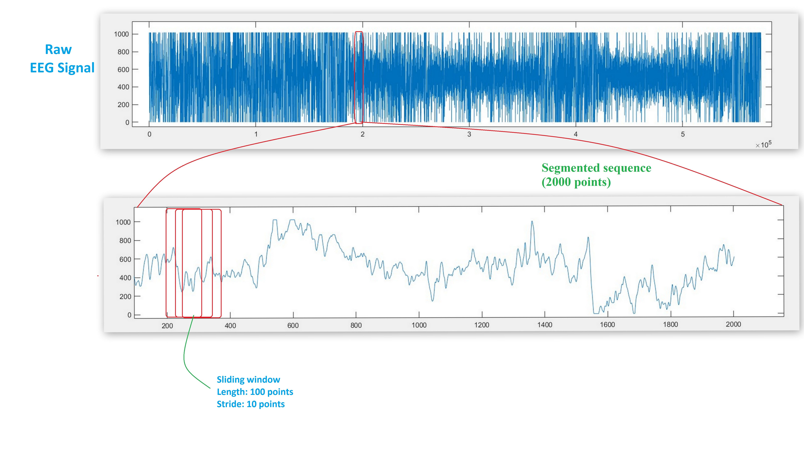
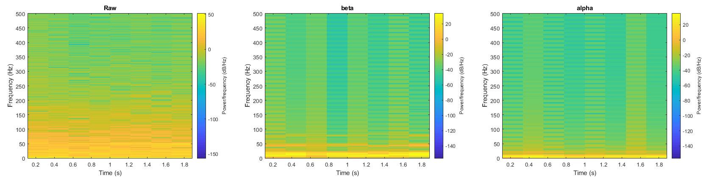
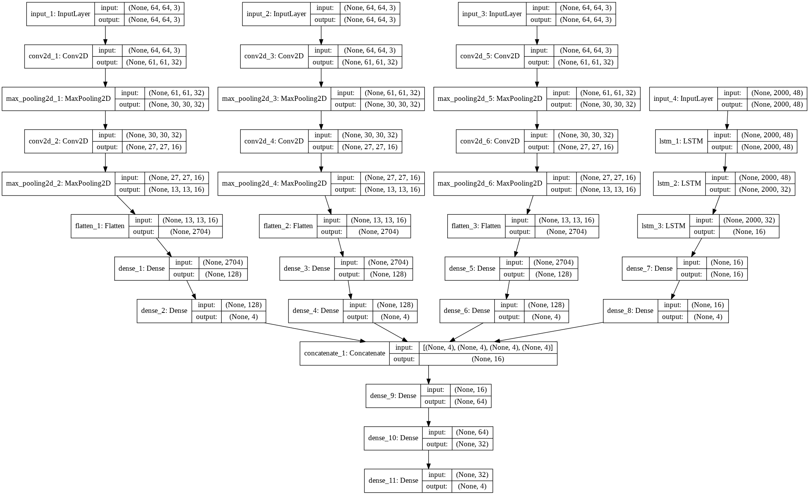

# Brain_EEG_signal_processing

   
  

Please cite our paper
https://ieeexplore.ieee.org/abstract/document/9203672/ 

R. Hassan, S. Hasan, M. J. Hasan, M. R. Jamader, D. Eisenberg and T. Pias, "Human Attention Recognition with Machine Learning from Brain-EEG Signals," 2020 IEEE 2nd Eurasia Conference on Biomedical Engineering, Healthcare and Sustainability (ECBIOS), Tainan, Taiwan, 2020, pp. 16-19, doi: 10.1109/ECBIOS50299.2020.9203672. 

@INPROCEEDINGS{9203672,
  author={R. {Hassan} and S. {Hasan} and M. J. {Hasan} and M. R. {Jamader} and D. {Eisenberg} and T. {Pias}},
  booktitle={2020 IEEE 2nd Eurasia Conference on Biomedical Engineering, Healthcare and Sustainability (ECBIOS)}, 
  title={Human Attention Recognition with Machine Learning from Brain-EEG Signals}, 
  year={2020},
  volume={},
  number={},
  pages={16-19},}

My Google Scholar account:
https://scholar.google.com/citations?user=wWSwk3YAAAAJ&hl=en&authuser=1 
